# FPGA QPSK Digital Communication Chain

### Fixed-Point DSP, Polyphase FIR and Hardware Optimization in Verilog

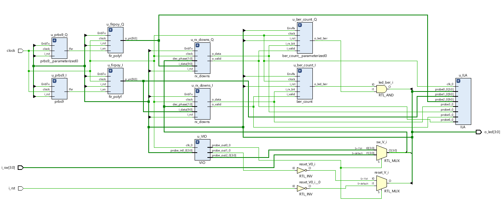

## Introduction

This project implements a QPSK digital communication chain from
floating-point modeling in Python to fixed-point RTL implementation
on FPGA.

The system includes PRBS9 generation, QPSK symbol mapping, pulse
shaping using a Raised Cosine FIR filter, configurable sampling-phase
decimation, symbol decision and BER estimation.

The design was first developed and validated in Python using
floating-point arithmetic. The complete chain was then converted to
fixed-point representation, defining the numerical resolution of
each hardware stage and analyzing quantization error and overflow.

The final architecture was implemented in Verilog and validated
through simulation and FPGA testing using Vivado.

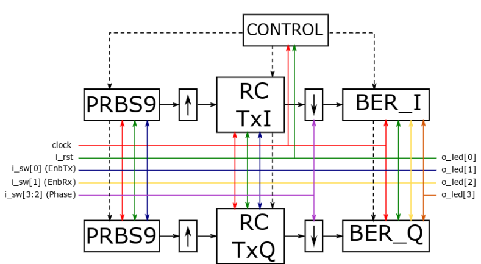

## Fixed-Point Design

The floating-point model was converted to fixed-point arithmetic
before the RTL implementation.

The Raised Cosine filter coefficients were normalized and quantized
using different numbers of fractional bits.

The quantization resolution was selected using a Signal-to-Error
Ratio (SRE) criterion of at least 40 dB.

The resulting filter coefficient representation was:

S(8,7)

8 total bits:
- 1 sign bit
- 7 fractional bits

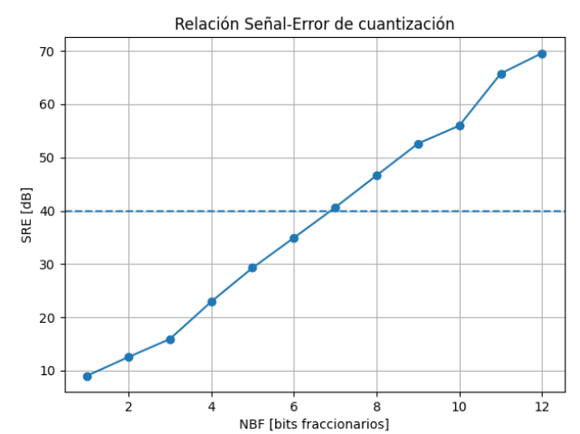

Hardware resource optimization through numerical range analysis:

| Block             | Representation |
| ----------------- | -------------- |
| PRBS9             | 1 bit          |
| Mapper / Upsample | S(2,0)         |
| FIR coefficients  | **S(8,7)**     |
| Product           | S(10,7)        |
| FIR accumulator   | **S(10,7)**    |
| Decimator         | S(10,7)        |
| Decision          | 1 bit          |

## Multiplier Elimination

Because QPSK symbols are represented as +1 and -1, multiplication
by the filter coefficient can be replaced by a simple sign selection:

    +1 × h = +h
    -1 × h = -h

A 2:1 multiplexer selects between +h and -h according to the
transmitted symbol.

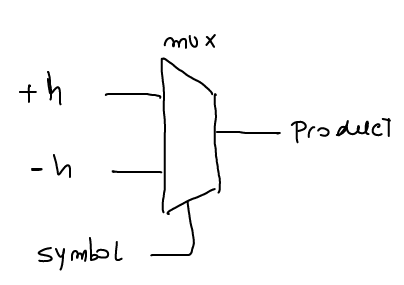

This removes the need for general-purpose multipliers in the FIR
data path.

### Symbol Representation

The mapper and upsampling operations were simplified at RTL level.

Since the FIR only needs to distinguish between the sign of the
current symbol and the absence of a symbol, the hardware representation
was reduced to a 1-bit symbol representation.

## Hardware-Efficient PRBS Synchronization

The BER receiver requires synchronization between the received PRBS9
sequence and the locally generated reference.

A direct cross-correlation implementation would require additional
hardware resources.

Instead, a correlation-inspired sequential matching algorithm was
implemented.

For each candidate alignment:

- If RX matches the local PRBS bit, the match counter is incremented.
- If RX does not match, the local PRBS is shifted by one position.
- After 30 consecutive matches, the transmitter and receiver are
  considered synchronized.

This approach approximates the detection of a correlation peak while
significantly simplifying the required hardware.

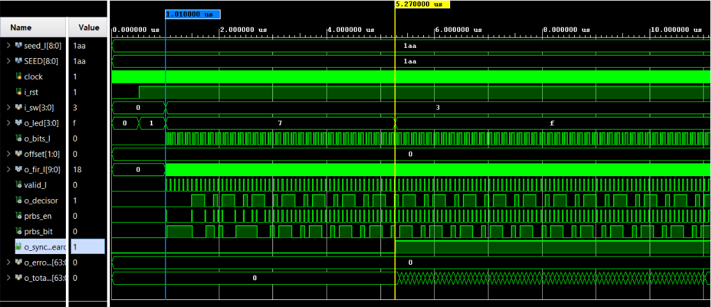

## BER Measurement

Once synchronization is achieved, the received bits are compared
against a locally generated PRBS9 sequence.

The error detector uses:

    error = RX XOR PRBS9_reference

Two counters are used:

- Error counter
- Total received bit counter

BER is calculated as:

    BER = number_of_errors / number_of_received_bits

## Raised Cosine FIR coefficients — Floating Point vs S(8,7)
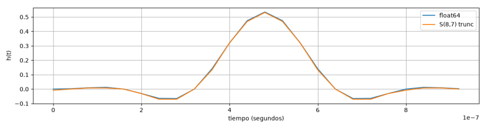

## Eye diagram – floating-point vs. S(10,7) comparison
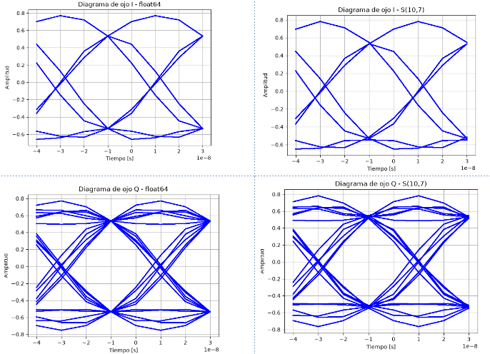

## Constellation – floating-point comparison with S(10,7)
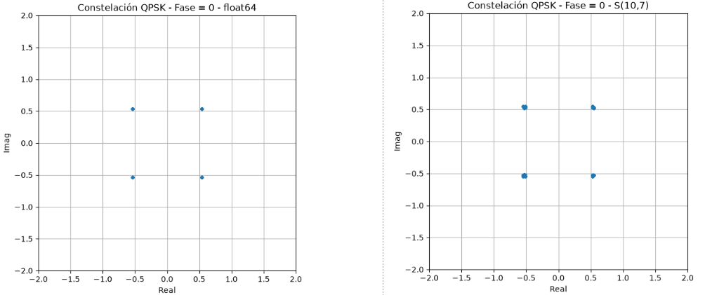
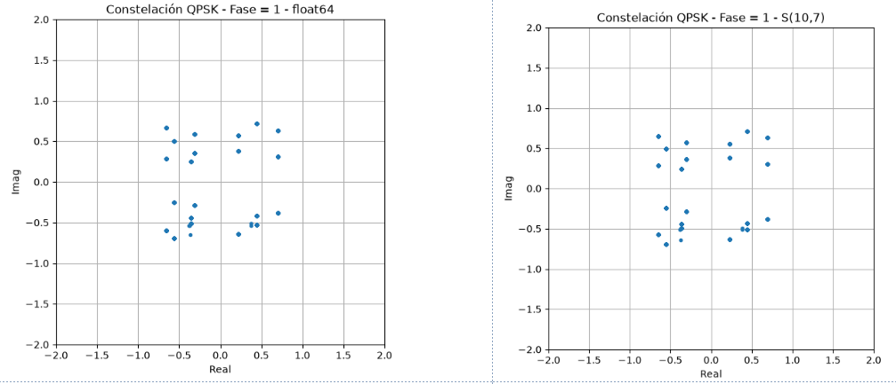
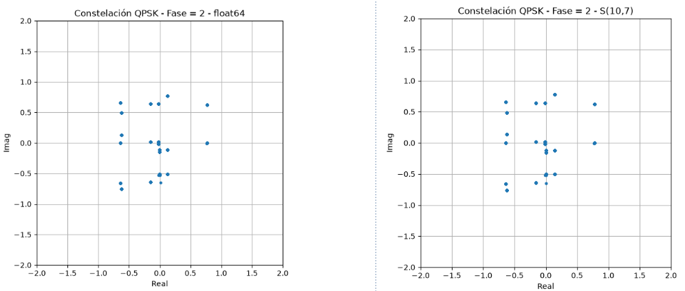
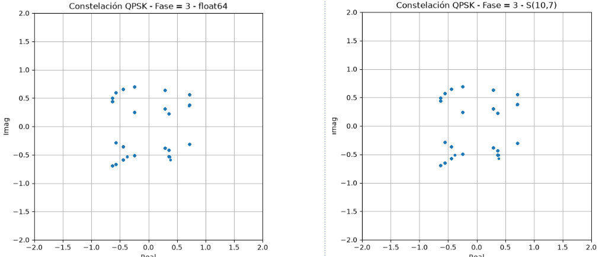

## VIO and ILA Implementation on FPGA
The VIO (Virtual Input/Output) and ILA (Integrated Logic Analyzer) were implemented on the Artix-7 FPGA.
The VIO controls the reset, four switches, and LED indicators.
The ILA allows for the visualization of the LED output, the Raised Cosine FIR filter output, and the downsampler output.
The image shows the ILA display with phase = 0.

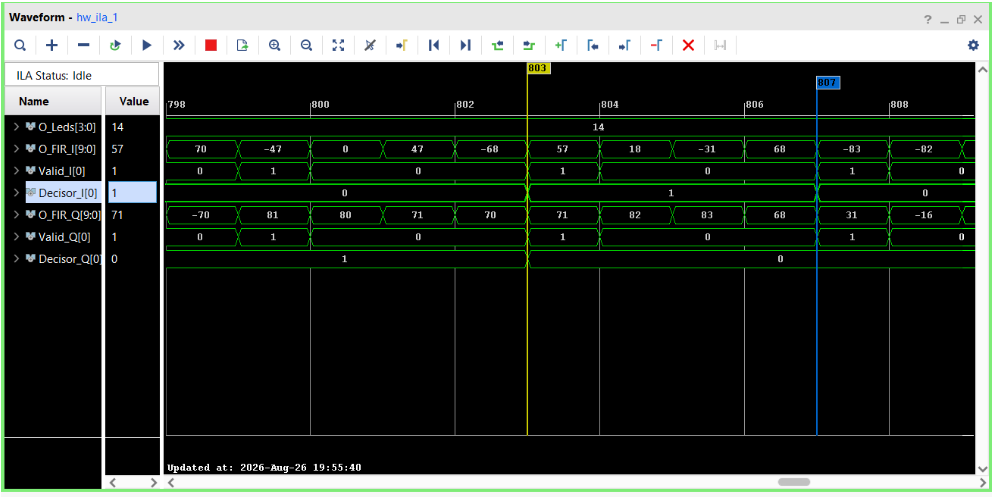
